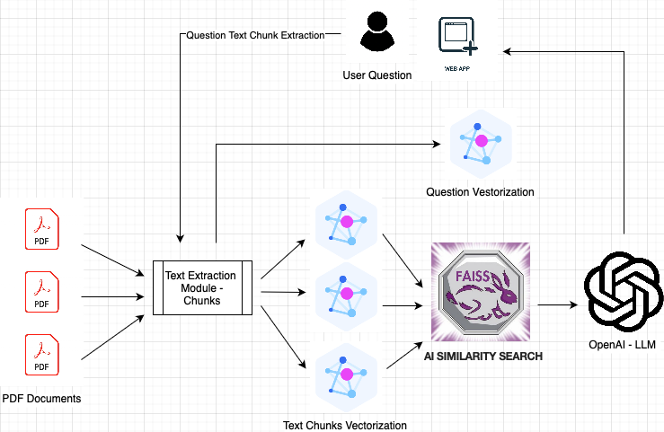
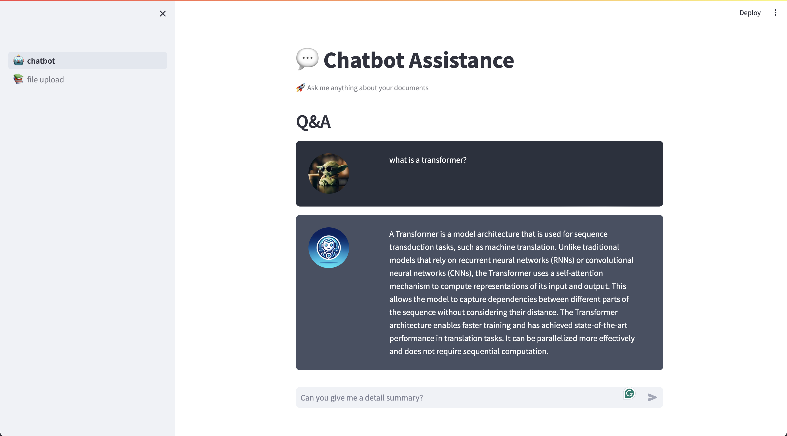

The PDF Guru Chatbot 📜

Welcome to the PDF Guru Chatbot, your friendly neighborhood expert on all things PDF! 🧙‍♂️

Why Choose PDF Guru Chatbot?

Are you tired of wrestling with PDFs like they're stubborn cats? Sick of navigating through endless pages to find that one elusive piece of information? Look no further! The PDF Guru Chatbot is here to save the day (and your sanity).

Features 🌟

Instant PDF Wisdom: Ask any PDF-related question, and our chatbot will provide you with answers faster than you can say "Portable Document Format."
Cat-Friendly Navigation: Our chatbot's user interface is so intuitive that even your cat could use it. (Disclaimer: Cats might prefer chasing mice over using our chatbot.)
Jokes and Puns Galore: We believe in combining business with pleasure, so prepare for PDF-themed jokes and puns that will keep you entertained as you work with your documents.
How to Use PDF Guru Chatbot 🤖

Simply type your PDF-related question into the chatbox. No need for lengthy, complicated queries.
Hit "Enter" and let the PDF Guru work its magic!
Be prepared for both useful information and a good chuckle.
Example Queries 💬

"Give me a detailed Summary?"

Contributions and Improvements 🛠️

Feel free to contribute to the PDF Guru Chatbot project! Whether it's adding more PDF jokes, improving the user interface, or expanding its knowledge base, we welcome your creativity and expertise. Just remember to keep it fun and light-hearted!

Disclaimer 📢

Architecture

Demo

Next Features:  
* WebSite text extraction
* Word Documents 
* Secure Documents Upload for Knowledge Base 